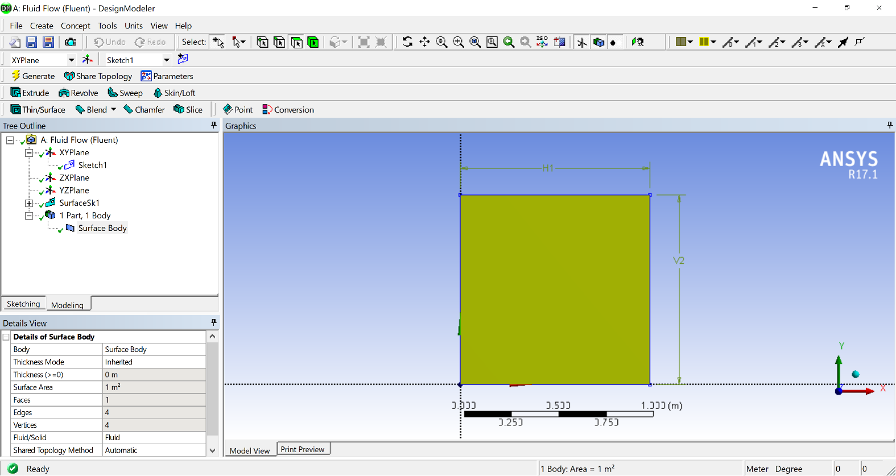

# Lid-Driven Cavity Flow Simulation using ANSYS Fluent

## Overview

This project presents a two-dimensional computational fluid dynamics (CFD) simulation of the classical **lid-driven cavity flow** problem using **ANSYS Fluent**.

The lid-driven cavity is one of the most widely used benchmark problems in fluid mechanics and numerical simulation because of its simple geometry and well-documented reference solutions. In this study, the flow field inside a square cavity is analyzed for several Reynolds numbers and validated against the benchmark results reported by **Ghia et al. (1982)**.

The project includes:

* Geometry generation
* Structured mesh generation
* Fluent setup and boundary conditions
* Numerical solution of incompressible laminar flow
* Velocity and pressure contour visualization
* Streamline analysis
* Validation against benchmark data

---

## Problem Description

The simulation considers a square cavity filled with an incompressible Newtonian fluid.

### Boundary Conditions

* Top wall moves horizontally with constant velocity
* Remaining walls are stationary
* No-slip condition applied on all walls

The governing Reynolds number is defined as:

[
Re = \frac{V L}{\nu}
]

Where:

* (V) = lid velocity
* (L) = cavity length
* (\nu) = kinematic viscosity

---

## Software Used

* ANSYS Workbench
* ANSYS DesignModeler
* ANSYS Meshing
* ANSYS Fluent

---

## Geometry

A two-dimensional square cavity with dimensions:

[
1 \text{ m} \times 1 \text{ m}
]

was created in ANSYS DesignModeler.

### Geometry



---

## Mesh Generation

A structured quadrilateral mesh was generated to improve numerical accuracy and solution stability.

### Mesh


---

## Simulation Conditions

The simulations were performed for the following Reynolds numbers:

| Reynolds Number |
| --------------- |
| 100             |
| 400             |
| 1000            |
| 5000            |

The Reynolds number was controlled by changing the velocity of the moving lid.

---

# Results

## Reynolds Number = 100

### Pressure Contour


### Velocity Contour


### Streamlines


### u-Velocity Distribution


### v-Velocity Distribution


---

## Reynolds Number = 400

### Pressure Contour


### Velocity Contour


### Streamlines


### u-Velocity Distribution


### v-Velocity Distribution


---

## Reynolds Number = 1000

### Pressure Contour


### Velocity Contour


### Streamlines


### u-Velocity Distribution


### v-Velocity Distribution


---

## Reynolds Number = 5000

### Pressure Contour


### Velocity Contour


### Streamlines


### u-Velocity Distribution


### v-Velocity Distribution


---

## Validation

The obtained numerical results were compared with the benchmark data published by:

> Ghia, U., Ghia, K. N., & Shin, C. T. (1982).
> *High-Re solutions for incompressible flow using the Navier-Stokes equations and a multigrid method.*

The comparison showed good agreement between the simulation and reference data, confirming the validity of the numerical model.

---

## Conclusions

* The lid-driven cavity problem was successfully simulated using ANSYS Fluent.
* The numerical results captured the expected vortex structures and velocity distributions.
* Increasing Reynolds number led to stronger recirculation zones and secondary vortices near the corners.
* The simulation results showed acceptable agreement with benchmark solutions from the literature.

---

## Repository Structure

```text
lid-driven-cavity-ansys-fluent/
│
├── README.md
├── report/
├── images/
├── validation/
└── fluent-setup/
```

---

## Author

**Ali Darfashi**
Mechanical Engineering Student
CFD and Heat Transfer Enthusiast
